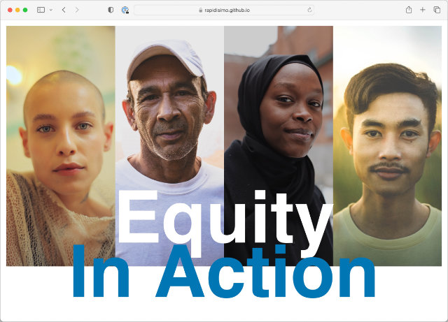
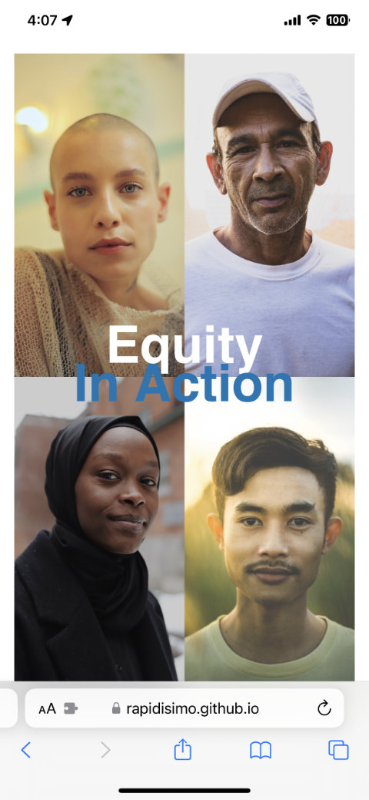

## Technical Assessment

### Objective
Re-create “Equity In Action” hero using a single index.html using HTML and CSS.

### Resources & Assets

**Images**
4 x hero images
Desktop Mockup
Mobile Mockup

**Colors** (For use on hero images)
- #0074B8 (blue)
- #00AD62 (green)
- #FFFF00 (yellow)
- #8EC650 (light green)

**Typeface**
Inter: https://fonts.google.com/specimen/Inter

### Challenges
1. ✅ Create a responsive layout that incorporates text atop individual images that change aspect ratio when the viewport changes.
2. ✅ Have the text continue to be part of the document flow.
3. ✅ Consider accessibility needs (aria label / not using br tag for semantic reasons).
4. ❌ Match filter applied to images.
5. ❌ Incorporate semi-translucent rectangle across image
6. ✅ Determine size requirements / manually measure mockups.
7. ✅ Typeface doesn't match what was provided - Original appears to be Helvetica (provided fallback in CSS)
8. ❓ Currently facing an issue with firefox where the placement of the h1 is not consistent with other browsers.

### Preliminary Research
- Overlapping elements with CSS Grid: https://youtu.be/EashgVqboWo?si=7M0m9A6-WmYyY00_
- Alt text for background images:https://www.davidmacd.com/blog/alternate-text-for-css-background-images.htmlhttps://www.w3.org/WAI/GL/wiki/ARIATechnique_usingImgRole_with_aria-label_forCSS-backgroundImagehttps://developer.mozilla.org/en-US/docs/Web/Accessibility/ARIA/Roles/img_role
- CSS filters:https://developer.mozilla.org/en-US/docs/Web/CSS/filter
- Line break in H1 visually vs semantically: https://css-tricks.com/injecting-line-break/#comment-1601720

## Preview

